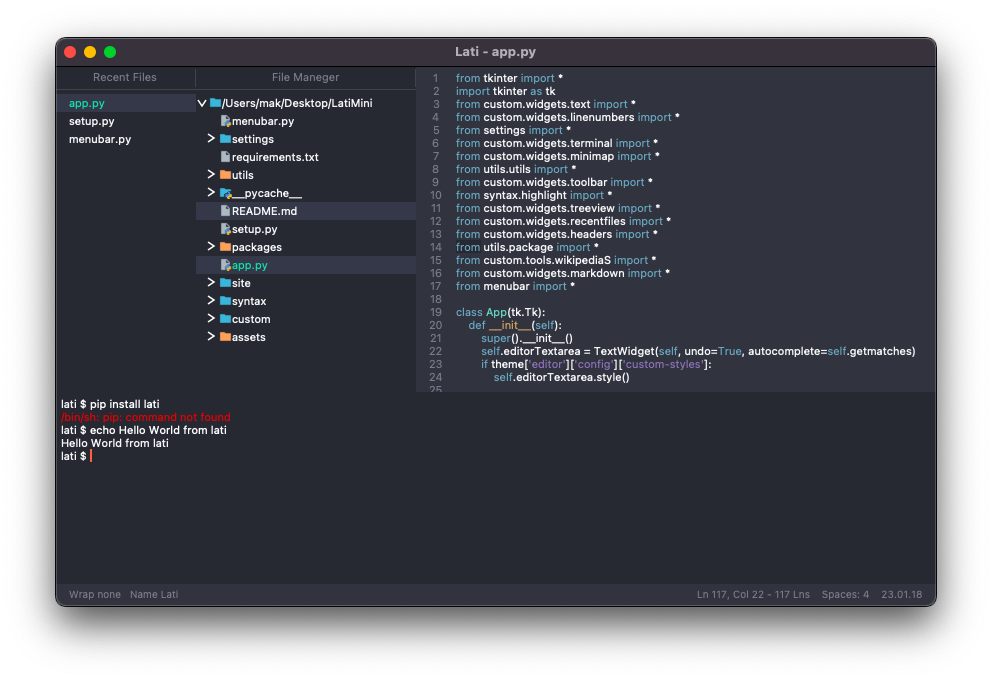

# KometShift is Open Source
## 23.19.01
In the new version of KometShift, a lot of interesting and important things have been added, but unfortunately, built-in applications will not be in this update, but here is a list of all the new visions:

 - Past repository commits were successful.
 - Documentation updated.
 - Wiki added.
 - Bug fixes.
 - Optimization.

I will try my best to fix any mistakes and help you as much as possible.

## KometShift
KometShift it also the property of the creator, you can create your own versions with references to the creator and this repository or our website.

KometShift is a handy tool for editing code, it is perfect for developing applications and debugging, it has a built-in list of packages for convenient work.

KometShift is also configured for work, you can also download and make your own versions of this product.

## Contributing
There are many ways you can contact us, you can also help us   
or report a bug or edit:

 - You can write to our social networks.
 - You can write in our github forums or other platforms.
 - You can send us an email.
 
 You can also read the wiki and also learn something new about the field of application development and programming, also learn more about the project.

## Bundled Extensions
This product contains a lot of built-in packages for convenient work, they can also be turned on and off, as well as adding your own languages ​​​​for writing code and writing your own packages using easy `json` file syntax example of this is: `Russian-Language`, `Windows-Keyboard`, `Embedded-Applications`.

## Development
This project is very easy to learn, also writing your own functions and packages, you can also create your own version, to do this, you need to follow a few steps:

 - Download this project to your device, also have downloaded `Python`
   version `3.11` and higher, also have an idea about programming in
   general.
 - Also, download the required file via pip, namely `requirement.txt` and
   paste one command into the command line `pip install -r
   requirements.txt`.
 - To launch applications via the command line, this is one command
   python `setup.py `must already be in this directory beforehand: `cd
   path`.

> Also if you get `pip` error try `pip3` same with `python/python3`.
  
After these steps, you can simply and flexibly customize applications for yourself using the pact system, also customize the application code and write (add) your functions,    a simple example of writing your own package:

```json
{
    "manifest": "test-pack",
    "state": true,
    "run": {
        "auto-interpretator": true,
        "hand-interpretator": "usr/bin/python3"
    }
}
```

## License
Licensed under the [MIT](https://github.com/KometShiftKom/KometShift/blob/main/LICENSE) license.