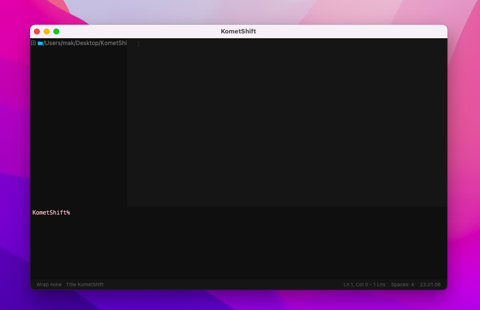
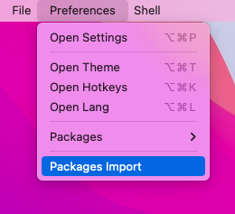
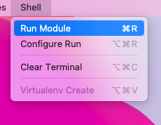

## Welcome in KometShift
A convenient code editor for editing files for Python, there is also a convenient system of packages and plugins for customizing the editor for yourself, or you can even create your own using the functions that are already included in applications from the box, there is also a convenient code launch system and an internal console.

## Version 23.06.01
In the new version and the first version, a lot of things were added, the developer console, the code launch system, saving recent files, code highlighting, the package system, connecting to the server for update information (you can put your own server) as well as a settings system and improving documentation, adding launch settings code, and an information bar at the bottom for detailed information about the file name of the project and also the version of the project.

## Getting started
What do you need to install:

1. Download the .zip archive of the project from github and upload it to your working folder.
2. Start terminal and enter project folder: `cd <path>`.
3. Run the setup file: `python setup.py` command.

> I advise you to use other editors to run the application After
> installation, be sure to download the necessary modules (they are in
> the *settings.json* file) and there the "modules" list is a list of the
> necessary.

## Requirements
Install *Python* on your computer and also read the installation documentation below. Run on any platform using Python. Also, for stable operation of the application.

*You need at least: 2gb RAM, 2 vCPUs.*

## Tools
Built-in developer console, convenient and easy settings, package system, multi-platform editing ability, syntax highlighting system, minor settings, also change the language, also the ability to create your own theme and integrate any language into the editor.

A simple system for running Python code, as well as settings and viewing, many new features will be added to this function as the project becomes available.

## License
KometShift uses an open license *GNU v3 License*.

## Contribution
If you are interested, please contact the author of the project among those available for communication.

## Contact the author
If you want to write to the creator or give advice on improving the code, you can write to this mail: **kometisgit@gmail.com**